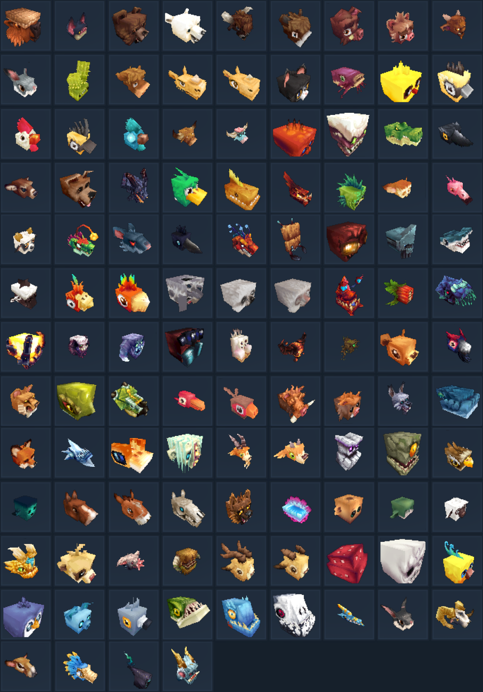

# Mob Heads
A Plugin that adds all Mob Heads as Blocks.

---
# Features
- 113 mob heads as placeable blocks
- Heads drop from NPCs on death with configurable chance
- Admin commands to configure drop behavior
--- 

# Heads

---

# How to Use

## Commands
### /mobheads
Lists all available mob heads.

### /mobheads config
Shows current drop configuration.

### /mobheads config chance <value>
Sets the drop chance percentage (0-100).

### /mobheads config exclude <head>
Excludes a specific head from dropping.

### /mobheads config include <head>
Re-includes a previously excluded head.

### /mobheads config reload
Reloads the config file from disk.

---

# Contributing
Suggestions, ideas, and feedback are welcome.

---

# Socials
### X: [@MarggxDev](https://x.com/MarggxDev)

### Discord: [Marggx](https://discord.gg/rNZvMSb7eQ)